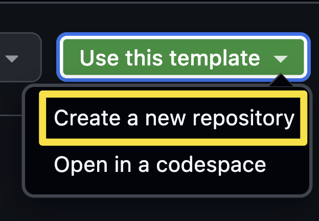
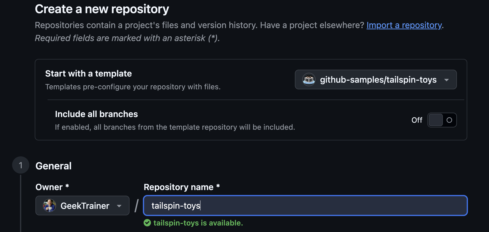
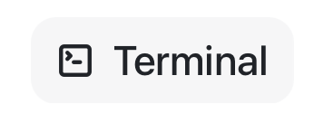
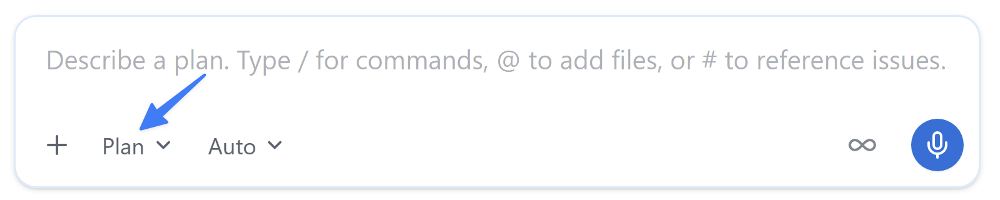
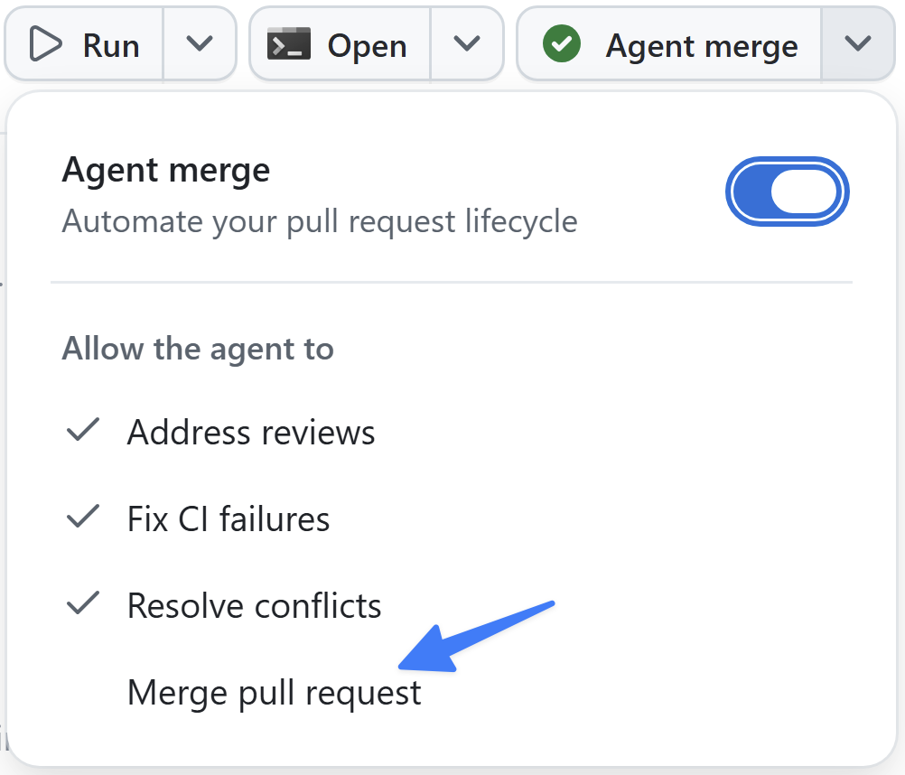

author: GitHub
summary: GitHub Copilot app 入門ワークショップ (beginner)
id: github-copilot-workshop
categories: AI, Development
environments: Web
status: Published
feedback link: https://example.com/feedback

# GitHub Copilot app 入門ワークショップ

## ワークショップについて
Duration: 5

GitHub Copilot app 入門ワークショップへようこそ！

[**GitHub Copilot app**](https://docs.github.com/copilot/concepts/agents/github-copilot-app) は Copilot CLI を基盤とするデスクトップアプリケーションで、エージェント主導の開発を単一の作業用ワークスペースで実現します。並列エージェントセッション、切り替え可能なセッションモード、共有キャンバス、GitHub Issue と pull request のネイティブ管理機能を備えています。さらに、リベース、レビューのフィードバック、CI の修正、マージまで pull request を導く **Agent Merge** も利用できます。


### 本日のゴール

一連のレッスンでは、アプリをインストールしてプロジェクトを設定した後、アプリのワークスペースと、テンプレートによって用意されたバックログを確認します。まず、星評価を追加する小さな変更に取り組みます。次に、Issue に基づいてカスタム指示の標準を追加し、分離されたエージェントセッションでフィルター機能を構築して、再利用可能なスキルで検証します。Playwright MCP server を追加して実際のブラウザーで機能を確認した後、段階的にマージの自動化を進め、最後は **Agent Merge** で pull request をマージします。最後に、共有キャンバスで共同作業し、繰り返し発生する作業を自動化します。アイデアから機能のマージまで、開発の一連の流れを体験できます。

### レッスンの構成

| レッスン | トピック | 説明 |
|--------|-------|-------------|
| 0. 前提条件 | セットアップ | Node.js をインストールし、Tailspin Toys プロジェクトの自分用コピーを作成します |
| 1. Copilot app のインストール | セットアップ | アプリをインストールしてプロジェクトを接続し、ワークスペースを確認します |
| 2. 最初のエージェントセッションの実行 | 最初の変更 | セッションを開始し、最初の pull request として小さな変更をリリースします |
| 3. カスタム指示による Copilot のガイド | コンテキスト | Issue に基づいてドキュメント標準を追加し、マージします |
| 4. Autopilot による機能の構築 | コア機能 | Plan と Autopilot を使ってフィルター機能を構築し、スキルで検証します |
| 5. Playwright MCP によるテスト | 外部ツール | Playwright MCP server を追加し、ブラウザーで機能を確認します |
| 6. Agent Merge によるマージ | マージ | Agent Merge でフィルター機能の pull request を修正してマージします |
| 7. キャンバスを使った計画 | コラボレーション | 共有キャンバスを作成し、作業の計画と追跡に使用します |
| 8. 振り返りと次のステップ | まとめ | 繰り返し発生するタスクを自動化し、次に学ぶ内容を確認します |

### 前提条件

このワークショップに参加する前に、次のものを用意してください。

- 有効な **Copilot Student、Pro、Pro+、Business、Enterprise** のいずれかのプランが設定された GitHub アカウント
- **macOS、Linux、Windows** のいずれかを実行するコンピューター
- コンピューターに[インストールされた Git](https://github.com/git-guides/install-git)

> aside positive
> 有料プランを利用していない場合、認証済みの学生は [GitHub Education](https://github.com/education/students) を通じて GitHub Copilot を無料で利用できます。**Copilot Student** プランには、このワークショップで使用するエージェント、MCP、コードレビュー、Copilot CLI の各機能が含まれているため、すべてのレッスンを完了できます。

> aside negative
> **Copilot app は codespace ではなく自分のコンピューターで実行します。**レッスン 0 では、アプリをインストールする前に Node.js をインストールし、プロジェクトの自分用コピーを作成します。また、Copilot Business または Copilot Enterprise を使用している場合、アプリを使用するには管理者が **Copilot CLI** ポリシーを有効にする必要があります。

### 出典とライセンス

このワークショップは [github-samples/copilot-workshops](https://github.com/github-samples/copilot-workshops) の [GitHub Copilot app ワークショップ](https://github-samples.github.io/copilot-workshops/app/)（日本語版 `docs/ja-jp/app`）をベースに、Google Codelab 形式へ再構成したものです。

原典は **MIT License** で公開されています。

> MIT License
>
> Copyright (c) 2023 GitHub
>
> Permission is hereby granted, free of charge, to any person obtaining a copy of this software and associated documentation files (the "Software"), to deal in the Software without restriction, including without limitation the rights to use, copy, modify, merge, publish, distribute, sublicense, and/or sell copies of the Software, and to permit persons to whom the Software is furnished to do so, subject to the following conditions:
>
> The above copyright notice and this permission notice shall be included in all copies or substantial portions of the Software.
>
> THE SOFTWARE IS PROVIDED "AS IS", WITHOUT WARRANTY OF ANY KIND, EXPRESS OR IMPLIED, INCLUDING BUT NOT LIMITED TO THE WARRANTIES OF MERCHANTABILITY, FITNESS FOR A PARTICULAR PURPOSE AND NONINFRINGEMENT. IN NO EVENT SHALL THE AUTHORS OR COPYRIGHT HOLDERS BE LIABLE FOR ANY CLAIM, DAMAGES OR OTHER LIABILITY, WHETHER IN AN ACTION OF CONTRACT, TORT OR OTHERWISE, ARISING FROM, OUT OF OR IN CONNECTION WITH THE SOFTWARE OR THE USE OR OTHER DEALINGS IN THE SOFTWARE.

## レッスン 0: 前提条件
Duration: 15

GitHub Copilot app は、Copilot と GitHub の両方を一元的に扱うデスクトップアプリです。Issue や pull request にすばやくアクセスでき、もちろん GitHub Copilot を使った開発も可能です。このワークショップでは、Astro で構築された Tailspin Toys アプリと GitHub Copilot app を使い、ローカル環境で作業します。始める前に、Node.js がローカルにインストールされていることを確認してから、Copilot app をインストールします。

このレッスンでは、次の内容を学習します。

- プロジェクトのテストを実行できるよう Node.js をインストールする。
- テンプレートから Tailspin Toys プロジェクトの自分用コピーを作成する。

### Node.js をインストールする

いくつかのレッスンでは、エージェントに機能を構築させ、Tailspin Toys のテストスイートをローカルで実行します。そのためには [**Node.js**](https://nodejs.org/) (プロジェクトに必要な唯一のランタイム) が必要です。バージョン **22 以降**をインストールしてください。現在の **LTS** リリースを選ぶと安心です。

どのプラットフォームでも、公式インストーラーを使うのが最も簡単です。

1. Windows Terminal、macOS のターミナル、または普段使用しているターミナルを開きます。
2. 次のコマンドを実行し、Node.js 22 以降がインストールされていることを確認します。

    ```shell
    node --version
    ```

3. `v22` 以上のバージョン番号が表示された場合は、次のセクションに進めます。

> aside positive
> Node.js がインストールされていない場合、または更新が必要な場合にのみ、以降の手順を実行してください。

4. [Node.js のダウンロードページ](https://nodejs.org/en/download)を開きます。
5. 使用しているオペレーティングシステム向けの **LTS** ビルドをダウンロードします。
6. インストーラーを実行し、既定の設定を選択します。Windows では、**Add to PATH** を選択したままにします。
7. インストールが完了したら、新しいターミナルを開きます。
8. 新しいターミナルで次のコマンドを実行し、インストールを確認します。

    ```bash
    node --version
    ```

9. `v22.x.x` 以上が表示されることを確認します。

> aside positive
> コンテナーを使用する場合、[**Docker**](https://www.docker.com/products/docker-desktop/) があれば、Node.js をローカルにインストールする代わりにリポジトリの [dev container](https://code.visualstudio.com/docs/devcontainers/containers) を使用できます。dev container には Node.js が含まれているため、両方を用意する必要はありません。

### ラボ用リポジトリを設定する

Tailspin Toys プロジェクトの自分用コピーを使って作業します。[テンプレートリポジトリ](https://docs.github.com/repositories/creating-and-managing-repositories/creating-a-template-repository)からコピーを作成してください。新しいリポジトリにはラボに必要なすべてのファイルが含まれています。次のレッスンで、このリポジトリをアプリに接続します。

1. 新しいブラウザーウィンドウで、このラボの GitHub リポジトリ `https://github.com/github-samples/tailspin-toys` を開きます。
2. ラボ用リポジトリのページで **Use this template** ボタンを選択し、**Create a new repository** を選択して、リポジトリの自分用コピーを作成します。

    

3. GitHub または Microsoft が主催するイベントの一環としてワークショップに参加している場合は、メンターの指示に従ってください。それ以外の場合は、GitHub Copilot を利用できる Organization に新しいリポジトリを作成できます。

    

4. 作成したリポジトリのパス (**organization-or-user-name/repository-name**) を記録します。このラボで後ほど使用します。

> aside positive
> テンプレートからリポジトリを作成すると、GitHub Issue のバックログが自動的に作成されます。ワークショップ全体を通してこれらの Issue を使用するため、自分で作成する必要はありません。

### まとめと次のステップ

準備が整いました。プロジェクトをコンピューター上でビルドしてテストできるように Node.js をインストールし、テンプレートから Tailspin Toys リポジトリの自分用コピーを作成しました。

次は GitHub Copilot app をインストールし、作成したリポジトリを接続して、ワークスペースを確認します。レッスン 1「GitHub Copilot app のインストール」に進んでください。

### リソース

- [Node.js のダウンロード](https://nodejs.org/en/download)
- [テンプレートからのリポジトリの作成](https://docs.github.com/repositories/creating-and-managing-repositories/creating-a-template-repository)
- [GitHub Copilot app について](https://docs.github.com/copilot/concepts/agents/github-copilot-app)

## レッスン 1: GitHub Copilot app のインストール
Duration: 15

[**GitHub Copilot app**](https://docs.github.com/copilot/concepts/agents/github-copilot-app) は、エージェント主導の開発に使用するデスクトップアプリケーションです。GitHub Copilot CLI を基盤とし、GitHub とネイティブに統合されているため、リポジトリ、ブランチ、CI パイプラインをすぐに利用できます。すべての作業を自分で行うのではなく、複数のエージェントをそれぞれ分離されたワークスペースで並列に指示し、繰り返し発生するタスクを自動化するワークフロー向けに設計されています。Node.js のインストールとプロジェクトのコピーが完了したので、次はアプリをインストールして、そのリポジトリを接続します。

このレッスンでは、次の内容を学習します。

- GitHub Copilot app をインストールしてサインインする。
- GitHub リポジトリからプロジェクトをアプリに追加する。
- テンプレートによって用意されたバックログを含め、ワークスペースを確認する。
- クイックチャットを試して、アプリ自体について学ぶ。

### シナリオ

チームは、増え続けるバックログに対応するために AI エージェントを導入しています。Copilot app では、Issue の選択、エージェントの実行、変更のレビュー、pull request のマージを一か所から指示できます。このレッスンでは、アプリをインストールして接続し、プロジェクトについての会話を始められるようにします。

> aside positive
> 対象となる Copilot プランが必要です。Copilot Student またはいずれかの有料プラン (Pro、Pro+、Business、Enterprise) を利用してください。Copilot Business または Copilot Enterprise を使用している場合、アプリを動作させるには管理者が **Copilot CLI** ポリシーを有効にする必要があります。

### GitHub Copilot app をインストールして構成する

GitHub Copilot app を使用するには、まずアプリをインストールします。Windows、macOS、Linux 向けのバージョンが用意されています。アプリをインストールして認証し、Tailspin Toys リポジトリを追加します。

1. ブラウザーで [GitHub Copilot app のランディングページ](https://gh.io/app)を開きます。
2. 使用しているプラットフォーム向けのアプリをダウンロードし、ランディングページの手順に従ってインストールします。
3. インストールが完了したら、アプリを開きます。
4. **Sign in to GitHub** を選択し、画面の指示に従って認証します。GitHub Enterprise Server を使用している場合は **Use GitHub Enterprise** を選択し、求められたらサーバーアドレスを入力します。
5. 認証後、リポジトリを接続するよう求められます。先ほど作成した `<YOUR_GITHUB_HANDLE>/tailspin-toys` という名前の Tailspin Toys リポジトリを選択します。
6. **Continue** を選択してオンボーディングを続けます。
7. テーマの選択を求められたら、最も好みのものを選び、**Finish** を選択します。

> aside positive
> Tailspin Toys のコピーが一覧に自動的に表示されなかった場合は、アプリのオンボーディングを完了した後に追加できます。完了すると、Copilot app のホーム画面が表示されます。そこで **Choose from GitHub** を選択し、リポジトリ名 (\<YOUR_GITHUB_HANDLE\>/tailspin-toys) で検索して選択します。これでリポジトリが Copilot app に追加されます。

### ワークスペースを確認する

プロジェクトを接続したら、各領域を確認します。アプリのサイドバーは、主に次の領域で構成されています。

- **Sessions** - エージェントが作業する場所です。各セッションは分離された独自のワークスペースで実行されるため、変更が競合することなく複数のセッションを同時に実行できます。次のレッスンで最初のセッションを開始します。
- **Quick chats** - 独自のブランチやワークスペースを必要としない、質問やブレインストーミング向けの簡易的な会話です。このレッスンの最後に試します。
- **My work** - アプリの **GitHub ネイティブ統合**を通じて表示される Issue と pull request です。アプリを離れずに、Issue と pull request の参照や絞り込み、CI ステータスの確認、Issue からのセッション開始、pull request のレビューを行えます。
- **Automations** - スケジュールまたはオンデマンドで実行する、保存済みのエージェントタスクです。ワークショップの終盤で作成します。

#### 用意されたバックログを確認する

アプリは GitHub とネイティブに統合されているため、リポジトリで待機中の作業がアプリ内に表示されます。テンプレートからリポジトリを作成したときに、バックログとなる Issue が用意されています。表示されていることを確認します。

1. サイドバーで **My work** を選択します。
2. テンプレートはバックログに 8 件の Issue を用意しています。このワークショップでは次の 3 件に焦点を当てます。表示されていることを確認してください。

   - Allow users to filter games by category and publisher
   - Update our repository coding standards
   - Implement pagination on the game list page

3. Issue を選択して詳細を読みます。各 Issue はエージェントセッションの開始点にもなります。ワークショップの後半では、これらの Issue から作業を開始します。

> aside positive
> My work の項目一覧は自動的に絞り込まれ、Copilot app に追加したリポジトリの項目だけが表示されます。ほかのリポジトリの作業項目を表示するには、そのリポジトリをアプリに追加してください。

### クイックチャットを試す

アプリに慣れるには、アプリ自体について質問するのが効果的です。その用途には **quick chat** が適しています。Quick chats ではブランチや worktree を作成せずに質問やブレインストーミングができるため、セッションを必要としない、その場限りの簡単な質問に最適です。

1. サイドバーで **Quick chats** の横にある **+** を選択し、新しいチャットを開きます。
2. アプリのセッションがどのように動作するかを尋ねます。

   ```plaintext
   How does the GitHub Copilot app use worktrees?
   ```

3. 会話ビューで回答を読みます。各セッションが分離された独自の git worktree で実行されるため、変更が競合することなく複数のエージェントを並列実行できることがわかります。会話はいつでも継続でき、新しいチャットも開始できます。

### まとめと次のステップ

GitHub Copilot app をインストールし、プロジェクトを接続して、ワークスペースを確認しました。学習した内容は次のとおりです。

- アプリをインストールして GitHub にサインインする。
- GitHub リポジトリからプロジェクトを追加する。
- ワークスペースを確認し、**My work** で用意されたバックログを見つける。
- クイックチャットを使って、その場限りの簡単な質問をする。

次は、最初のエージェントセッションを開始し、ゲームカードに星評価を表示する最初の変更をプロジェクトに加えます。レッスン 2「最初のエージェントセッションの実行」に進んでください。

### リソース

- [GitHub Copilot app について](https://docs.github.com/copilot/concepts/agents/github-copilot-app)
- [GitHub Copilot app の概要](https://docs.github.com/copilot/how-tos/github-copilot-app/getting-started)
- [GitHub Copilot app でのエージェントセッションの操作](https://docs.github.com/copilot/how-tos/github-copilot-app/agent-sessions)

## レッスン 2: 最初のエージェントセッションの実行
Duration: 20

前のレッスンでは、ワークスペースを確認し、クイックチャットを使いました。ここでは、**エージェントセッション**を開始し、プロジェクトに最初の変更を加えます。変更は小規模なものにします。ゲームのデータにはすでに星評価が含まれていますが、ホームページのゲームカードにはまだ表示されていません。エージェントに表示を依頼し、変更をレビューして、最初の pull request としてマージします。

このレッスンでは、次の内容を学習します。

- エージェントセッションを開始し、セッションの構成を理解する。
- プロジェクトに小規模で対象を絞った変更を加えるようエージェントに依頼する。
- ワークスペースの差分ビューで変更をレビューする。
- アプリをローカルで実行し、ブラウザーで変更を確認する。
- 最初の pull request を作成してマージする。

### シナリオ

Tailspin Toys の各ゲームには星評価を設定でき、ゲーム詳細ページにはすでに表示されています。一方、ホームページのゲームカードには、タイトル、カテゴリー、パブリッシャー、説明だけが表示されています。最初のセッションの準備運動として、各カードに既存の評価を表示するようエージェントに依頼します。小規模で自己完結した、最初のセッションに最適な変更です。

### セッションの構造

**セッション**とは、分離された独自のワークスペースで実行されるエージェントとの会話です。すべてのセッションに**専用の git worktree とブランチ**が割り当てられます。そのため、一方では機能を追加し、もう一方ではバグを修正するなど、変更を競合させずに複数のセッションを同時に実行できます。セッションはリポジトリごとにグループ化されてサイドバーに表示され、選択すると切り替えられます。

セッション内には、エージェントとの**会話**、ファイルを調査および編集するときのエージェントの**ツールアクティビティ**、差分付きの**変更済みファイル**一覧という3つの要素が表示されます。

### セッションを開始して変更を依頼する

新しいセッションを開始し、プロジェクトの調査と機能の実装に取りかかります。前のレッスンでは、GitHub リポジトリからプロジェクトを追加しました。そのリポジトリ用の新しいセッションを作成し、変更を依頼します。

1. GitHub Copilot app に戻ります。アプリを閉じている場合は開きます。
2. **Home screen** を選択します。
3. リポジトリに `tailspin-toys` が選択されていることを確認します。

   

4. 次のプロンプトを使って変更を依頼します。

   ```plaintext
   On the game cards, show each game's star rating. The Game type already includes a starRating field — it's a number out of 5, or null when a game hasn't been rated yet. Display it on each card in src/components/GameCard.astro, and when starRating is null show "No rating yet" instead. Keep the change small and don't restructure the card layout.
   ```

> aside positive
> プロンプトに、Copilot が更新するファイル名が含まれていることに注目してください。Copilot が作業に含めるファイルを指定する必要はありませんが、方向性を示すことで、コードをすばやく生成し、トークン使用量を削減できます。

5. <kbd>Enter</kbd> を選択して、プロンプトを Copilot に送信します。

Copilot app は、最初にプロジェクトの分離されたコピーである新しい worktree を作成して作業を開始します。次にプロジェクトを調査し、新機能の追加に必要な更新対象ファイルを見つけて、必要なコードを作成します。これで Copilot app を使って新機能を追加できました。

### 差分をレビューする

AI が生成したすべての変更は、どれほど小さくてもマージ前にレビューする必要があります。Copilot app 内で変更を確認します。

1. アプリの右上隅にある **Toggle review panel** を選択します。Copilot が行った未処理の変更がすべて表示される差分画面が開きます。

   

2. ゲームの詳細表示に使用される中心的なファイル `GameCard.astro` にコードが追加されていることを確認します。次のような小さなブロックが追加されているはずです。評価がある場合は表示し、`starRating` が `null` の場合は "No rating yet" を表示します。

   ```astro
   {game.starRating !== null ? (
       <span class="text-xs font-medium px-2.5 py-0.5 rounded bg-amber-900/60 text-amber-300" data-testid="game-rating">
           ★ {game.starRating} / 5
       </span>
   ) : (
       <span class="text-xs font-medium text-slate-500" data-testid="game-rating-empty">
           No rating yet
       </span>
   )}
   ```

> aside positive
> Copilot は、すべての生成 AI ツールと同様に決定論的ではなく確率的に動作するため、実際のコードは上記と異なる場合があります。ただし、比較的よく似たものになります。

### 変更を確認する

コードを読むだけで動作すると判断せず、視覚的にもテストします。そのためには、ターミナルからアプリを起動して、すべてが動作することを確認する必要があります。Copilot app にはターミナルが組み込まれています。

1. Copilot app の右側にあるレビューパネルで **Terminal** を選択します。**Terminal** ボタンがない場合は、**+** (**Open in panel** というラベルが付いています) を選択してから **Terminal** を選択します。

   

2. ターミナルウィンドウに次のコマンドを入力し、Web アプリの開発サーバーを起動します。

   ```shell
   npm run dev
   ```

3. サーバーが起動したら、ブラウザーウィンドウを開きます。起動には少し時間がかかります。
4. http://localhost:4321 に移動します。
5. ランディングページのすべてのゲームに星評価が表示されていることを確認します。
6. ターミナルウィンドウに戻ります。
7. <kbd>Ctrl</kbd>+<kbd>C</kbd> を選択して開発サーバーを停止します。

### 最初の pull request を作成してマージする

変更に問題がないことを確認できたので、リリースします。エージェントに pull request の作成を依頼し、github.com で自分でレビューしてマージします。今回は手動で管理します。後のレッスンでは、Copilot でこの作業の一部を自動的に処理する方法を確認します。

1. 右上隅にある **Create PR** を選択します。
2. 求められた場合は **Sign in with your browser** を選択し、画面の指示に従って認証します。
3. Copilot が PR の作成を開始します。

PR が作成されると、Copilot はリポジトリで実行する必要があるワークフローを監視します。しばらくすると、右上のボタンが **Ready to merge** に変わります。これは PR をマージする準備が整ったことを示します。

4. チャットのすぐ上にある **PR** バブルを選択し、レビューペインで PR を開いて pull request を確認します。必要に応じて、ここで PR をレビューできます。
5. 準備ができたら **Ready to merge** を選択します。
6. 新しいダイアログウィンドウで **Merge pull request** を選択し、pull request をマージします。

これで Web サイトに新機能を反映できました。

### まとめと次のステップ

最初のエージェントセッションを開始し、最初の変更をリリースしました。具体的には、次の作業を行いました。

- エージェントセッションを開始し、セッションの構成を学習した。
- ゲームカードに小規模で対象を絞った変更を加えるようエージェントに指示した。
- ワークスペースの差分ビューで変更をレビューした。
- アプリをローカルで実行し、ブラウザーで星評価を確認した。
- pull request を作成し、github.com で自分でマージした。

次は、アプリを使ってリポジトリにカスタム指示の標準を追加します。バックログ内の Issue の1つから作業を開始します。レッスン 3「カスタム指示による Copilot のガイド」に進んでください。

### リソース

- [GitHub Copilot app でのエージェントセッションの操作](https://docs.github.com/copilot/how-tos/github-copilot-app/agent-sessions)
- [GitHub Copilot app について](https://docs.github.com/copilot/concepts/agents/github-copilot-app)
- [GitHub Copilot app での Issue と pull request の管理](https://docs.github.com/copilot/how-tos/github-copilot-app/managing-issues-and-pull-requests)

## レッスン 3: カスタム指示による Copilot のガイド
Duration: 20

生成 AI を扱うとき、コンテキストは重要です。タスクを特定の方法で実行する必要がある場合や、Copilot が把握しておくべき背景情報がある場合は、そのコンテキストを利用できるようにします。特に強力なツールの1つが[指示ファイル](https://docs.github.com/copilot/customizing-copilot/about-customizing-github-copilot-chat-responses)です。指示ファイルには、必要なコードの内容だけでなく、その構成方法も記述します。このレッスンでは、リポジトリにドキュメント標準を追加します。ここから先の多くの作業と同様に、バックログの Issue から開始し、エージェントに変更を行わせます。

このレッスンでは、次の内容を学習します。

- リポジトリ指示とパス固有の指示ファイルがエージェントにどのように渡されるかを確認する。
- バックログ内の指示に関する Issue からセッションを開始する。
- `.github/copilot-instructions.md` にドキュメント標準を追加するようエージェントに依頼する。
- 変更をレビューし、pull request としてマージする。

### シナリオ

優れた開発組織と同様に、Tailspin Toys にも開発プラクティスのガイドラインと要件があります。内容は次のとおりです。

- TSDoc doc comment の形式でコードにドキュメントを追加する。
- フォーマット方法を文書化し、lint によって適用する。

指示ファイルを使用すると、示されたプラクティスに沿ってタスクを実行するために必要な情報を Copilot に提供できます。

### 指示ファイル

カスタム指示を使うと、Copilot にコンテキストと設定を提供でき、コーディングスタイルや要件をより正確に理解させることができます。Copilot をガイドし、より関連性の高い提案やコードスニペットを得るための強力な機能です。希望するコーディング規約、ライブラリ、コードに含めるコメントの種類まで指定できます。リポジトリ全体に適用する指示や、タスクレベルのコンテキストとして特定のファイル種類に適用する指示を作成できます。

指示ファイルには2つの種類があります。

- `.github/copilot-instructions.md` は、リポジトリに対する**すべての**リクエストで Copilot に送信される単一の指示ファイルです。このファイルには、Copilot に送信するほとんどのチャットまたは CLI リクエストに関係する、プロジェクトレベルの情報を記載します。使用する技術スタック、構築するものの概要、ベストプラクティスなど、全体に適用するガイダンスを含められます。
- `.github/instructions/*.instructions.md` ファイルは、特定のタスクやファイル種類向けに作成できます。特定の言語 (TypeScript や Astro など) や、UI コンポーネントまたは新しい単体テスト一式の作成といったタスクに関するガイドラインを提供できます。

> aside positive
> Copilot は AGENTS.md、CLAUDE.md、GEMINI.md を通じて指示のガイダンスを取り込むほかの標準もサポートしており、常に適切なコンテキストを提供できます。

#### 指示ファイルを管理するためのベストプラクティス

指示ファイルの作成方法を詳しく説明することは、このワークショップの範囲外です。ただし、サンプルプロジェクトに含まれる例は、代表的なアプローチを示しています。概要は次のとおりです。

- `copilot-instructions.md` の指示は、構築するものの説明、プロジェクトの構造、全体的なコーディング標準など、プロジェクトレベルのガイダンスに絞ります。
- `*.instructions.md` ファイルは、ファイル種類 (単体テスト、Astro コンポーネント、データレイヤー) または特定のタスクに固有の指示を提供するために使用します。
- 自然言語を使います。ガイダンスは明確にし、コードの適切な例と不適切な例を提示します。

AI の使い方に唯一の方法がないのと同様に、指示ファイルの作成方法にも唯一の正解はありません。プロジェクトに最適な方法は、試行を重ねることで見つけられます。

> aside positive
> GitHub Copilot を使用するすべてのプロジェクトには、充実した指示ファイル一式を用意することをお勧めします。このプロジェクトのファイルを確認すると、多くのコードファイル種類に対応する指示ファイルがあることがわかります。
>
> テンプレートや出発点が必要な場合は、指示ファイル、カスタムエージェントなどのリソースが揃ったリポジトリ [awesome-copilot](https://awesome-copilot.github.com/) を確認してください。

### このプロジェクトのカスタム指示ファイルを確認する

このリポジトリに含まれる指示ファイルを確認します。中心となる `copilot-instructions.md` が1つと、さまざまなタスクに対応する `*.instructions.md` ファイル一式があります。エディターまたは GitHub Web UI で開いてください。

1. レビューパネルが表示されていない場合は、右上の **Toggle review panel** を選択して開きます。

   

2. **+** を選択し、レビューパネルに新しい項目を追加します。
3. **File** を選択します。
4. `copilot-instructions.md` を検索します。
5. ファイル一覧から `copilot-instructions.md` を選択して開きます。
6. ファイルを確認します。プロジェクトの簡単な説明に加えて、**Agent notes**、**Code standards**、**Scripts**、**Repository Structure** などのセクションがあります。**Code standards** の下には、ネストされた **GitHub Actions Workflows** のガイダンスがあります。これらは Copilot とのすべてのやり取りに適用されます。
7. **Show folder view** を選択して、フォルダーナビゲーターを開きます。

   

8. `.github/instructions` フォルダーに移動し、ファイルを確認します。Astro ファイル、Drizzle データレイヤー、テストなどに対応する指示があります。
9. `.github/instructions/unit-tests.instructions.md` を開きます。先頭の `applyTo` フィールドに注目してください。これはリポジトリのルートを基準とする glob で、指示を適用するファイルを決定します。ここでは、TypeScript のテストファイル (`**/*.test.ts` に一致するファイルなど) が対象になります。
10. このプロジェクトで単体テストを作成するための固有の指示を確認します。
11. 最後に `.github/instructions/drizzle.instructions.md` を開き、末尾まで移動します。ほかの指示ファイル (`unit-tests.instructions.md` など) と、プロジェクト内の既存ファイルへのリンクに注目してください。これにより、大きな指示セットを小さく再利用可能なファイルに分割し、コード生成時に参照する例を Copilot に提示できます。そこに記載されたパスは、リポジトリのルートではなく指示ファイルを基準とします。

> aside positive
> `copilot-instructions.md` の **Code formatting requirements** セクションにはプロジェクトのコーディング標準が記載されていますが、コード内のドキュメントはまだ必須ではありません。次の手順で、TSDoc doc comment とファイルコメントヘッダーの規則を追加します。

### 指示に関する Issue から開始する

前のレッスンでは、直接入力したプロンプトからセッションを開始しました。しかし、多くの作業は Issue から始まります。指示ファイルを更新するために登録された Issue に基づいて新しいセッションを作成し、更新を依頼します。

> aside positive
> 指示ファイルは Copilot が生成するコードに大きな影響を与えるため、Copilot を明確にガイドする内容になっていることを慎重に確認してください。このレッスンのように、Copilot で最初のバージョンを作成した後、自分でレビューして更新内容が要件を満たすことを確認する方法が効果的です。

1. サイドバーで **My work** を選択します。
2. **Update our repository coding standards** というタイトルの Issue を選択して開きます。
3. 右上の **New session** を選択し、Issue に基づく新しいセッションを開始します。

   

4. 次のプロンプトを使い、Issue に記載された要件を満たすように指示ファイルを更新することを Copilot に依頼します。

  ```plaintext
  Following this issue, make the updates to the instructions files in this project to meet the requirements documented. Don't create the PR quite yet!
  ```

Copilot が更新を行います。

### 変更をレビューする

Copilot が行った更新を読み、更新された指示に基づいて生成するコード例も提示させます。

1. 右上の **Changes** を選択してコードの変更を開きます。

   

2. 更新された指示ファイルをレビューします。コードにドキュメントとコメントを追加するためのガイドラインが含まれていることを確認します。

> aside positive
> AI は決定論的ではなく確率的に動作するため、実際のテキストは異なります。

3. 次のプロンプトを使い、Copilot が今後生成するコード例を作成するよう依頼します。

  ```plaintext
  Do not make any updates, but show me what the code would look like. Based on the new instructions, if I asked Copilot to create a new library component to return all Publishers what would that code look like?
  ```

4. Copilot が提案するコードをレビューします。更新された指示で求めたとおり、TSDoc doc comment とファイルヘッダーコメントが含まれていることを確認します。

これでプロジェクトの指示ファイルを更新し、その効果を確認できました。

### pull request を作成してマージする

指示ファイルはリポジトリのアセットとなり、チームのほかのメンバーと共有されます。ほかのアセットと同様に、作業内容を含む PR を作成します。

1. 右上隅にある **Create PR** を選択します。
2. 求められた場合は **Sign in with your browser** を選択し、画面の指示に従って認証します。
3. Copilot が PR の作成を開始します。

PR が作成されると、Copilot はリポジトリで実行する必要があるワークフローを監視します。しばらくすると、右上のボタンが **Ready to merge** に変わります。これは PR をマージする準備が整ったことを示します。

4. **Ready to merge** を選択します。
5. 新しいダイアログウィンドウで **Merge pull request** を選択し、pull request をマージします。

> aside positive
> 標準がデフォルトブランチにマージされると、すべてのメンバーと新しいセッションでプロジェクトの一部として利用できます。次のレッスンで最新のデフォルトブランチからフィルター機能のセッションを開始すると、エージェントは自動的にこの標準に従います。生成された TypeScript に、依頼していなくても TSDoc doc comment が含まれます。指示が生成コードを形作ることを示す、小さいながらも実際的な例です。

### まとめと次のステップ

アプリが指示ファイルからコンテキストを取得する仕組みを確認し、セッションを使ってリポジトリ全体の標準を追加してマージしました。具体的には、次の作業を行いました。

- リポジトリの `copilot-instructions.md` とパス固有の `*.instructions.md` ファイルを確認した。
- バックログ内の指示に関する Issue からセッションを開始した。
- `.github/copilot-instructions.md` にドキュメント標準を追加するようエージェントに依頼した。
- 変更をレビューし、pull request としてマージした。

次は、新しいセッションでフィルター機能を構築し、先ほどマージした標準が適用される様子を確認します。レッスン 4「Autopilot による機能の構築」に進んでください。

### リソース

- [GitHub Copilot をカスタマイズするための指示ファイル](https://docs.github.com/copilot/customizing-copilot/about-customizing-github-copilot-chat-responses)
- [GitHub Copilot app のカスタマイズ](https://docs.github.com/copilot/how-tos/github-copilot-app/customize-github-copilot-app)
- [カスタム指示を作成するためのベストプラクティス](https://docs.github.com/enterprise-cloud@latest/copilot/using-github-copilot/coding-agent/best-practices-for-using-copilot-to-work-on-tasks#adding-custom-instructions-to-your-repository)
- [Awesome Copilot - 指示ファイルなどのリソース集](https://awesome-copilot.github.com/)

## レッスン 4: Autopilot による機能の構築
Duration: 30

ここまで、プロジェクトに小さな更新をいくつか加えました。しかし、より本格的な変更には、よりしっかりしたプロセスが必要です。GitHub Copilot app は既存のフローと連携できるように設計されており、適切なものを適切な方法で構築できます。このレッスンから3回にわたり、一般的な開発プロセスに従います。まず Issue を使って新機能を生成し、エージェントスキルで検証テストと linter を実行します。

このレッスンでは、次の内容を学習します。

- フィルター機能に関する Issue から新しいセッションを開始する。
- **Plan** モードで機能を計画し、**Autopilot** で構築する。
- 生成されたコードが、以前マージしたドキュメント標準に従っていることを確認する。
- プロジェクトの `quality-checks` スキルで作業を検証する。

### シナリオ

ホームページにはすべてのゲームが一覧表示されますが、訪問者は一覧を絞り込めません。フィルター機能に関する Issue では、**カテゴリー**と**パブリッシャー**でゲームを絞り込めるようにすることが求められています。Copilot を使ってこの機能を実装します。

### 背景

AI コーディングエージェントを開発フローに導入しても、基本は変わりません。むしろ、基本はさらに重要になります。多くの開発者は、次のようなフローに従います。

1. 必要な作業の詳細が記載された Issue を開く。
2. 構築する内容の計画を作成する。
3. コードを構築してレビューする。
4. テストを実行してコードを検証する。
5. 新機能を手動で検証する。
6. pull request (PR) を作成する。
7. コードのレビューと継続的インテグレーションプロセスが成功したら、コードをマージする。

> aside positive
> 正確な手順はチームや Organization によって異なりますが、多くの場合は上記の流れを変形したものです。

この標準的なアプローチを守ることで、AI が生成したコードが定められた要件を満たし、人間が作成したコードと同じ審査プロセスを通るようにできます。

### セッションモード

**セッションモード**は、エージェントの自律性を制御します。プロンプトフィールド下のドロップダウンから設定し、いつでも変更できます。

- **Interactive**: ユーザーとエージェントが共同で作業します。エージェントは変更を提案し、続行前に入力を待ちます。
- **Plan**: エージェントが最初に計画を作成します。計画実行前に内容をレビューして承認します。
- **Autopilot**: エージェントが完全に自律して作業し、入力を待たずにコードの作成、テストの実行、反復を行います。

### フィルター機能を計画する

潜在的な問題を見つける最適なタイミングは、コードを作成する前です。そのためには、事前に少し計画を立てるのが効果的です。Copilot と計画を立てると、一連の手順と採用するアプローチが生成されます。その計画をレビューし、改善案があれば提案してから、計画に基づいて Copilot にコードを生成させることができます。

Issue を開いて新しいセッションを開始し、Plan モードに切り替えて計画を作成します。

1. ナビゲーションタブから **My work** を選択します。
2. **Allow users to filter games by category and publisher** というタイトルの Issue を選択します。
3. 右上の **New session** を選択します。

   

4. モードに **Plan** と表示されるまで <kbd>Shift</kbd>+<kbd>Tab</kbd> を選択します。

   

5. 次のプロンプトを送信します。Issue から開始したため、フィルター機能の Issue はすでにこのセッションのコンテキストに含まれています。

   ```plaintext
   Plan the work based on the requirements documented in the issue. Please ask any clarifying questions you might have as you build the plan.
   ```

6. 計画の作成中に、エージェントから追加の質問が提示される場合があります。自分で機能を構築するときの方針に基づいて回答します。

> aside positive
> Copilot は確率的に動作するため、追加で尋ねられる質問は異なります。質問がまったくない場合もありますが、問題ありません。

7. 完了すると、Copilot が計画の概要を提示します。計画をレビューしてください。クエリの構築、フィルターコントロールの追加、テストの作成が提案されているはずです。必要に応じてフィードバックを返して改善できます。エージェントは提案を新しいバージョンに反映します。

### Autopilot で構築する

計画が完成したので、Copilot に実装を構築させます。

1. **Plan summary** ダイアログのオプション一覧で、**Approve and implement with autopilot** に最も近いオプションを選択します。

Copilot が実装作業を開始します。

> aside positive
> Copilot が必要なコードの作成を自動的に開始しない場合は、"Go ahead and start building out the plan!" のようなプロンプトを使って開始を依頼できます。
>
> 必要な更新の作成には数分かかります。エージェントはファイルを編集および作成し、テストを作成して実行し、反復します。この時間に、ここまで学習した内容を振り返ったり、飲み物を用意したりできます。

### 変更をレビューする

AI が生成したすべてのコードは、マージ前にレビューする必要があります。コードをレビューし、サイトを実行して問題がないことを確認します。

1. 右上の **Changes** を選択してコードの変更を開きます。

   

2. 変更をレビューします。新しい TypeScript ファイル、Astro ファイル、テストファイルが表示されます。新しいヘルパー関数には、レッスン3でマージしたドキュメント標準に従い、依頼していなくても TSDoc doc comment とファイルヘッダーコメントが含まれていることを確認します。
3. Copilot app の右側にあるレビューパネルで **Terminal** を選択します。**Terminal** ボタンがない場合は、**+** (**Open in panel** というラベルが付いています) を選択してから **Terminal** を選択します。

   

4. ターミナルウィンドウに次のコマンドを入力し、Web アプリの開発サーバーを起動します。

   ```shell
   npm run dev
   ```

5. サーバーが起動したら、ブラウザーウィンドウを開きます。起動には少し時間がかかります。
6. http://localhost:4321 に移動します。
7. ランディングページでフィルターを使用できることを確認します。
8. 問題がある場合は、Copilot に更新を依頼できます。
9. 問題がなければ、ターミナルウィンドウに戻ります。
10. <kbd>Ctrl</kbd>+<kbd>C</kbd> を選択して開発サーバーを停止します。

### quality-checks スキルで作業を検証する

差分を目視で確認するだけで完了とすることもできますが、このチームには明確な品質基準と、それを繰り返し確認する方法があります。

**エージェントスキル**を使うと、テストの実行、ビルドの生成、pull request の作成など、繰り返し発生するタスクの実行方法を Copilot に指示できます。スキルは、エージェントが必要に応じて読み込める指示、スクリプト、リソースのフォルダーです。[Agent Skills はオープン標準](https://github.com/agentskills/agentskills)であり、さまざまなエージェントで使用されています。そのため、同じスキルをエージェントモードの Copilot Chat、Copilot cloud agent、Copilot CLI、GitHub Copilot app で使用できます。

スキルはプロジェクトの `.github/skills` フォルダー、またはグローバルの `~/.copilot/skills` に配置します。各スキルは、YAML frontmatter (`name` と `description`) と、それに続く Markdown の指示が記載された `SKILL.md` ファイルを含むフォルダーです。

```yaml
---
name: quality-checks
description: Run the project's test suites and linter to verify code changes are ready to commit, push, or merge.
---
```

スキルには、スクリプト、アセット、参考資料を含むサブフォルダーも追加できます。完全な構造については、[エージェントスキルの仕様](https://agentskills.io/specification)を参照してください。

> aside positive
> スキルは動的に読み込まれます。エージェントは `description` フィールドに基づいて適用するスキルを判断します。明確でシナリオに合った説明を記述することが、スキルが使用されるか無視されるかを左右します。

### quality-checks スキルを確認する

スキルの内容を確認します。

1. レビューパネルが表示されていない場合は、右上の **Toggle review panel** を選択して開きます。

   

2. **+** を選択し、レビューパネルに新しい項目を追加します。
3. **File** を選択します。
4. `SKILL.md` を検索します。
5. ファイル一覧から `SKILL.md .github/skills/quality-checks` を選択して開きます。
6. `name` と `description` を確認します。説明は、コード変更を commit、push、merge する前にテスト、lint、検証する必要がある場合に、このスキルを使用することをエージェントに伝えます。
7. スキル全体を読みます。単体テスト、Playwright のエンドツーエンドテスト、ESLint の各スイートを実行するスクリプト、実行順序、一般的な失敗のデバッグ方法が記載されています。そのため、エージェントは推測するのではなく、チームの方法でチェックを実行できます。

### チェックを実行する

同じフィルター機能のセッションで、エージェントに作業の検証を依頼します。スキル名を説明する必要はありません。エージェントがリクエストに一致するスキルを見つけます。

1. Copilot app に戻ります。
2. スラッシュコマンド `/quality-checks` を使ってスキルを直接呼び出し、<kbd>Enter</kbd> を選択します。
3. エージェントはスキルに従って単体テスト、linter、エンドツーエンドテストを実行し、結果を報告します。失敗したものがあれば、問題を修正して、すべて成功するまでチェックを再実行するよう依頼します。
4. **このセッションを開いたままにします。** 次のレッスンでは Playwright MCP server を追加し、実際のブラウザーでフィルター機能が動作することを確認します。

### まとめと次のステップ

実際の機能をエンドツーエンドで構築し、チームの基準に照らして検証しました。具体的には、次の作業を行いました。

- 最新のプロジェクトで、フィルター機能に関する Issue から新しいセッションを開始した。
- Plan モードで機能を計画し、Autopilot で構築した。
- 生成されたヘルパーが、レッスン3でマージしたドキュメント標準に従っていることを確認した。
- `quality-checks` スキルで作業を検証した。

次は Playwright MCP server を接続し、実際のブラウザーでフィルター機能を確認するようエージェントに依頼します。レッスン 5「Playwright MCP server によるテスト」に進んでください。

### リソース

- [GitHub Copilot app でのエージェントセッションの操作](https://docs.github.com/copilot/how-tos/github-copilot-app/agent-sessions)
- [Agent Skills について](https://docs.github.com/copilot/concepts/agents/about-agent-skills)
- [GitHub Copilot app のカスタマイズ](https://docs.github.com/copilot/how-tos/github-copilot-app/customize-github-copilot-app)
- [GitHub Copilot のクラウドサンドボックスとローカルサンドボックスについて](https://docs.github.com/copilot/concepts/about-cloud-and-local-sandboxes)

## レッスン 5: Playwright MCP によるテスト
Duration: 15

前のレッスンでは、プロジェクトの自動テストスイートを使ってフィルター機能を作成し、検証しました。テストによってコードの検証を自動化できますが、エージェント自身が動作を確認できるようにすることも効果的です。実際に作成している UI で問題を見つけた場合に、エージェントが対応できるようになります。MCP を使って AI エージェントに外部機能へのアクセスを提供する方法を確認し、Copilot が構築中のサイトを直接操作できるように Playwright MCP server を追加します。

このレッスンでは、次の内容を学習します。

- Model Context Protocol (MCP) の概要と、GitHub Copilot app での使用方法を理解する。
- アプリの設定から Playwright MCP server を追加する。
- エージェントにブラウザーを操作させ、フィルター機能を確認する。

### シナリオ

単体テストとエンドツーエンドテストは重要ですが、UI の更新を検証するには、実際に UI を操作する必要があります。変更作業をさらに自動化し、更新が期待どおりに動作するという確信を高めるために、ユーザーと同じ方法で Copilot が作業中の Web サイトを使用できるようにします。

### Model Context Protocol (MCP) とは

[Model Context Protocol (MCP)](https://github.blog/ai-and-ml/llms/what-the-heck-is-mcp-and-why-is-everyone-talking-about-it/) は、AI エージェントが外部のツールやサービスと通信するための手段を提供します。MCP を使うと、AI エージェントは外部のツールやサービスとリアルタイムで通信できます。その結果、最新情報へのアクセス (resources を使用) や、ユーザーに代わる操作 (tools を使用) が可能になります。

これらの tools と resources には、AI エージェントと外部のツールやサービスをつなぐ MCP server を通じてアクセスします。MCP server は、AI エージェントと外部ツール (既存の API や NPM パッケージなどのローカルツール) 間の通信を管理します。各 MCP server は、AI エージェントがアクセスできる異なる tools と resources のセットを表します。

よく使われる既存の MCP server には、次のものがあります。

- [**GitHub MCP Server**](https://github.com/github/github-mcp-server): GitHub リポジトリを管理するための API セットにアクセスできます。AI エージェントは、新しいリポジトリの作成、既存のリポジトリの更新、Issue と pull request の管理などを行えます。
- [**Playwright MCP Server**](https://github.com/microsoft/playwright-mcp): Playwright を使ったブラウザー自動化機能を提供します。AI エージェントは、Web ページへの移動、フォームへの入力、ボタンの選択などを行えます。

さまざまな tools と resources にアクセスできる MCP server がほかにも多数あります。GitHub は、エコシステム内での発見と貢献を促進するために [MCP registry](https://github.com/mcp) をホストしています。

> aside negative
> MCP server は、プロジェクト内のほかの依存関係と同様に扱ってください。使用する前にソースコードを慎重に確認し、発行元を検証して、セキュリティ上の影響を考慮します。信頼できる MCP server だけを使用し、機密性の高いリソースや操作へのアクセスを許可するときは注意してください。

### Playwright MCP server を追加する

MCP server はアプリの設定から追加して管理します。アプリには一般的なサーバーのカタログが含まれているため、[Playwright MCP server](https://github.com/microsoft/playwright-mcp) は数回の操作で追加できます。

1. <kbd>Ctrl</kbd>+<kbd>,</kbd> を選択して、Copilot app の設定ページを開きます。
2. **MCP servers** を選択します。
3. 検索ダイアログに `Playwright` と入力します。
4. **Popular MCP servers** の一覧から **Playwright** を選択します。
5. **Add server** を選択し、利用可能な MCP server の一覧に追加します。
6. <kbd>Esc</kbd> を選択して設定ダイアログを閉じます。

これで Playwright MCP server を追加できました。

### Playwright で機能を確認するよう Copilot に依頼する

Playwright MCP server を使って機能を手動テストするよう Copilot に依頼します。

1. 次のプロンプトを使い、新しい機能を検証するよう Copilot に依頼します。

   ```plaintext
   Start the dev server then use the Playwright MCP server to validate the functionality you just added exists. Use the details in the issue to ensure the newly added behavior matches the specs.
   ```

Copilot は Playwright MCP server を通じてブラウザーを起動し、各手順を実行して、確認結果を報告します。タスクの実行中、システム上で実際にブラウザーが開く様子を確認できます。

2. Issue の受け入れ条件と照らし合わせて概要を読みます。問題がある場合は、pull request を作成する前に追加の質問をするか、コードを修正するよう依頼します。
3. 次のレッスンでこの作業を完了するため、セッションを開いたままにします。

これで Copilot は、ユーザーと同じように機能を確認し、ブラウザーでも動作を検証しました。

### まとめと次のステップ

GitHub Copilot app から Playwright MCP server を使い、実際のブラウザーで機能を確認しました。学習した内容は次のとおりです。

- Model Context Protocol (MCP) の概要と、アプリで MCP tools を利用する仕組みを学習した。
- アプリの設定から Playwright MCP server を追加した。
- エージェントにブラウザーを操作させ、フィルター機能を確認した。

機能の構築と検証が完了し、動作することも確認できました。次は、**Agent Merge** を使って pull request の作成とマージをエージェントに任せ、機能をリリースします。レッスン 6「Agent Merge によるマージ」に進んでください。

### リソース

- [MCP とは何か、なぜ注目されているのか](https://github.blog/ai-and-ml/llms/what-the-heck-is-mcp-and-why-is-everyone-talking-about-it/)
- [Microsoft Playwright MCP Server](https://github.com/microsoft/playwright-mcp)
- [GitHub Copilot app での MCP server の構成](https://docs.github.com/copilot/how-tos/github-copilot-app/customize-github-copilot-app)

## レッスン 6: Agent Merge によるマージ
Duration: 15

フィルター機能の構築と検証が完了し、ブラウザーで動作することも確認できました。最後のステップはマージです。このワークショップではすでに2回マージしており、どちらも pull request を作成して github.com で自分でマージしました。今回は、pull request のライフサイクル全体をアプリ内から管理する **Agent Merge** に処理を任せます。

このレッスンでは、次の内容を学習します。

- Agent Merge の概要と、マージのライフサイクルを自動化する仕組みを学ぶ。
- フィルター機能のセッションで Agent Merge を有効にする。
- pull request の作成、CI の実行、すべて成功した後のマージを確認する。

### シナリオ

ここ数回のモジュールでは、コードの作成から Copilot による UI の直接検証まで、さまざまなレベルの自動化を確認しました。開発をさらに高速化するために、Tailspin Toys は審査および検証済みの pull request を自動的にマージする方法を検討しています。

### Agent Merge の概要

**Agent Merge** を使うと、Copilot app で pull request をマージするまでの最終工程を自動化できます。有効にすると、アプリのセッションが pull request を読み取り、失敗した CI チェックの修正、レビューコメントへの対応、必要に応じたリベースなど、マージを妨げる問題に対処します。そして GitHub で許可され次第、pull request をマージします。バックグラウンドで動作し、アプリを再起動しても継続し、pull request がマージされると自動的に無効になります。

ここまでは、github.com で自分で **Merge pull request** を選択していました。Agent Merge はその責任をエージェントに移すため、エージェントが PR の完了までを管理している間に次のタスクへ進めます。作業のレビューと承認は引き続き自分で行い、エージェントには機械的な最終工程だけを任せます。

### Agent Merge で PR を管理する

コードを手動でレビューし、テストを実行し、Copilot による UI の検証も完了しました。新しいコードをコードベースにマージします。Agent Merge に PR を継続的インテグレーション (CI) のプロセスからマージまで管理させます。

1. 前のモジュールでフィルター機能を追加していたセッションに戻ります。
2. 右上隅にある **Create PR** の横のドロップダウンを選択します。
3. **Agent merge** を選択して Agent Merge を有効にします。

   

4. ボタンのテキストが **Agent merge** に変わります。
5. **Agent merge** ボタンを選択し、Agent Merge のプロセスを開始します。

Copilot app が PR の作成と管理を開始します。最初にプロジェクトを調査して PR の最適な作成方法を判断し、新しい PR を作成します。

しばらくすると、Copilot が再び作業を開始し、リポジトリ上ですべてのテストを実行する CI プロセスなど、PR の条件を確認します。ほかのチームメンバーによるレビュー、実行が必要なチェック (CI プロセス)、PR をマージできるかどうかのステータスを報告します。

6. **Agent merge** の横にあるドロップダウンを選択してから **Merge pull request** を選択し、Agent Merge に pull request のマージを許可します。

   

7. すべての CI プロセスが成功すると、つまりテストに合格すると、Copilot が pull request をマージします。

### まとめと次のステップ

コードの生成、テストと検証、pull request のプロセスなど、開発プロセスの複数の部分を自動化しました。具体的には、次の作業を行いました。

- Agent Merge の概要と、マージのライフサイクルを自動化する仕組みを学習した。
- フィルター機能のセッションで Agent Merge を有効にした。
- pull request の作成、CI の実行、すべて成功した後のマージを確認した。

次は、エージェントと一緒に作業を計画して視覚化する、より高度な方法である**キャンバス**を確認します。レッスン 7「キャンバスを使った計画」に進んでください。

### リソース

- [GitHub Copilot app での Issue と pull request の管理](https://docs.github.com/copilot/how-tos/github-copilot-app/managing-issues-and-pull-requests)
- [GitHub Copilot app について](https://docs.github.com/copilot/concepts/agents/github-copilot-app)

## レッスン 7: キャンバスを使った計画
Duration: 15

ここまでは、チャットを通じてエージェントを指示してきました。しかし、多くの作業は会話の中ではなく、ボード、ドキュメント、チェックリスト上で行われます。**キャンバス**は、まさにそのような作業のために、アプリ内でユーザーとエージェントが共有できる領域です。このレッスンでは、ここまで取り組んできたバックログの計画と追跡に使用する、シンプルなキャンバスを作成します。

このレッスンでは、次の内容を学習します。

- キャンバスの概要と使用する場面を理解する。
- バックログをトリアージする共有 Kanban ボードのキャンバスを作成する。
- キャンバスをリポジトリに保存し、チーム向けにマージする。
- 新しいセッションでキャンバスを開き、そこから作業を開始する。

### シナリオ

Issue の一覧は、どのような状況でも負担に感じることがあります。Tailspin Toys の開発者は、Issue をすばやくトリアージし、Copilot app で作業を開始できるツールを探しています。

### キャンバスとは

[キャンバス](https://docs.github.com/copilot/how-tos/github-copilot-app/working-with-canvas-extensions)は、計画、トリアージボード、リリースチェックリスト、ダッシュボード、ドキュメントなどの作業成果物を扱う、共有の対話型領域です。チャットは意図の説明や曖昧さの検討に適していますが、多くの作業は具体的な*領域*上で行われます。キャンバスを使うと、その領域でエージェントと直接共同作業できます。

キャンバスは**双方向**です。エージェントが作業中にキャンバスを更新できる一方で、ユーザーも同じ領域を編集できます。キャンバスを作成すると、エージェントはプロンプトとワークフローに基づいて内容を構築します。その後も、機能の追加、削除、修正を依頼できます。作成したキャンバスは、アプリの右側のパネルに開きます。

一般的な例は次のとおりです。

- 1日の計画を立て、Issue と pull request に優先順位を付けるための **Markdown canvases**。
- ユーザーとエージェントがカードを追加し、作業を列間で移動する **Agentic kanban boards**。
- リポジトリの重要な Issue と繰り返し現れるテーマをまとめる **Issue triage boards**。

### キャンバスを使用する理由

タスクに構造、反復、検証が必要で、チャットだけでは不十分な場合はキャンバスを使用します。キャンバスでは次のことができます。

- ワークフローに合った実際の成果物に、エージェントの作業を結び付ける。
- 共有領域で作業を直接調整または修正し、その変更を基にエージェントに作業を続けさせる。
- チャットの応答だけでなく、成果物への目に見える変更として進捗を確認する。

### 作業を追跡するキャンバスを作成する

星評価、ドキュメント標準、フィルター機能をすべてマージし、多くの成果をリリースしました。しかし、バックログにはまだ項目が残っています。作業をすばやくトリアージするためのキャンバスを作成します。

1. GitHub Copilot app に戻ります。アプリを閉じている場合は開きます。
2. **Home screen** を選択します。
3. リポジトリに `tailspin-toys` が選択されていることを確認します。
4. プロンプトボックスで次のプロンプトを使用し、要件を満たすキャンバスを作成します。

   ```plaintext
   Create a basic Kanban board canvas that allows me to quickly triage work. Highlight the three issues which are most likely to need attention right now, with the remainder in a second section down below. The top three cards should include a description of the issue's content and a justification of why they're at the top of the list. Each issue should have a button that allows me to add it to the current context for the current session so I can get to work on it straightaway.
   ```

Copilot がキャンバスの作成を開始します。

> aside positive
> 作成には数分かかります。複雑なタスクであるため、最初のバージョンでは満足できない場合があります。理想のツールになるまで、プロンプトで構築を続けるよう依頼できます。

### キャンバスを保存してリポジトリにマージする

キャンバスは、指示ファイルやスキルと同様に、リポジトリのアセットにできます。Copilot にリポジトリへの追加とマージを依頼し、チーム全体で使用できるようにします。

1. 同じセッションで、次のプロンプトを使ってキャンバスをリポジトリに保存するよう Copilot に依頼します。

   ```plaintext
   Let's save this canvas definition to the repository so I can share it with my development team
   ```

2. Copilot がキャンバスファイルを保存したら、右上隅にある **Create PR** の横のドロップダウンを選択します。
3. **Agent merge** を選択して Agent Merge を有効にします。

   

4. ボタンのテキストが **Agent merge** に変わります。
5. **Agent merge** ボタンを選択し、Agent Merge のプロセスを開始します。

Copilot app が PR の作成と管理を開始します。最初にプロジェクトを調査して PR の最適な作成方法を判断し、PR を作成します。

しばらくすると、Copilot が再び作業を開始し、リポジトリ上ですべてのテストを実行する CI プロセスなど、PR の条件を確認します。ほかのチームメンバーによるレビュー、実行が必要なチェック (CI プロセス)、PR をマージできるかどうかのステータスを報告します。

6. **Agent merge** の横にあるドロップダウンを選択してから **Merge pull request** を選択し、Agent Merge に pull request のマージを許可します。

   

7. すべての CI プロセスが成功するまで待ちます。成功すると、Copilot が pull request を自動的にマージします。

これでチーム用の新しい共有キャンバスを作成できました。

### キャンバスで作業する

キャンバスを作成できたので、新しいセッションを開始して使用します。

1. Copilot app で **tailspin-toys** の横にある **New session** を選択し、新しいセッションを開始します。
2. 次のプロンプトを使い、トリアージ用キャンバスを開くよう Copilot に依頼します。

   ```plaintext
   Open the triage issues canvas
   ```

3. 作成したキャンバスが新しいセッションで開いたことを確認します。
4. 最も関心のある Issue の1つで **Add to current context** を選択します。
5. Copilot が Issue の作業を開始します。

これで、作成したキャンバスを使って開発プロセスを効率化できました。

### まとめと次のステップ

ユーザーとエージェントが共同作業できる共有領域を作成しました。具体的には、次の作業を行いました。

- キャンバスの概要と使用する場面を学習した。
- エージェントと共有の Kanban トリアージボードのキャンバスを作成した。
- Agent Merge を使ってキャンバスをリポジトリに保存し、マージした。
- 新しいセッションでキャンバスを開き、そこから作業を開始した。

バックログを追跡できるようになったので、ここまで構築した内容と今後の進め方を振り返ります。レッスン 8「振り返りと次のステップ」に進んでください。

### リソース

- [GitHub Copilot app での canvas extension の操作](https://docs.github.com/copilot/how-tos/github-copilot-app/working-with-canvas-extensions)
- [Awesome Copilot の Canvases](https://awesome-copilot.github.com/extensions/)
- [GitHub Copilot app について](https://docs.github.com/copilot/concepts/agents/github-copilot-app)

## レッスン 8: 振り返りと次のステップ
Duration: 10

ここ数回のレッスンでは、GitHub Copilot app を使い、アイデアから機能のマージまでを実践しました。取り組んだ内容は次のとおりです。

- リポジトリを接続し、アプリのワークスペースと用意されたバックログを確認した。
- 直接指定したタスクと Issue からセッションを開始し、Plan モードと Autopilot モードでエージェントの動作を制御した。
- カスタム指示と再利用可能なスキルでエージェントをガイドした。
- Playwright MCP server を使い、実際のブラウザーで作業をテストした。
- 共有キャンバスでエージェントと共同作業した。
- github.com で自分でマージする方法から、**Agent Merge** に pull request のマージを任せる方法まで、段階的なマージ自動化を使って変更をリリースした。

繰り返し発生する作業を自動化し、ベストプラクティスと今後の進め方を確認します。

### 繰り返し発生する作業を自動化する

アプリでは、**automations** を使って、スケジュールまたはオンデマンドでエージェントを実行できます。新しい Issue のトリアージや最近のアクティビティの振り返りなど、定型的なタスクに適しています。シンプルで破壊的でない automation を作成します。

1. サイドバーで **Automations** を選択してから **New automation** を選択します。
2. `Recap my recent work` などの名前を付けます。
3. トリガーを選択します。**Manual** はオンデマンドで実行し、**On a schedule** は自動的に実行し、**When an issue is created** は新しい Issue に反応します。このレッスンでは **Manual** を選択します。
4. automation が何も変更しないように、次の例のような読み取り専用のプロンプトを入力します。

   ```plaintext
   Summarize the pull requests merged in this repository over the last week, and list any issues still open in the backlog.
   ```

5. プロジェクト (Tailspin Toys リポジトリ) を選択し、automation を作成します。
6. オンデマンドで実行し、結果を確認します。

> aside positive
> Automations はローカルまたはクラウドで実行できます。スケジュールに従って無人で実行する場合は、**Run in the cloud** を有効にし、automation に使用を許可する **Tools** を選択します。出力を信頼できるようになるまでは、スケジュールされた automations の範囲を限定し、破壊的でないものにしてください。

### ベストプラクティス

AI ツールを使用するときは、その周辺の基盤が出力の品質を左右します。このワークショップでは、指示ファイル、スキル、カスタムエージェントがそれぞれ役割を果たしました。これらに投資し、セッション間で再利用してください。

タスクに合わせて**モードとモデル**を選択します。構築前にアプローチを検討するには **Plan**、対象を絞った変更で作業に関与し続けるには **Interactive**、範囲が明確で分離されたタスクに限って **Autopilot** を使用します。定型的な編集には高速なモデルを選び、複雑な作業には推論能力が高く、より多くの推論を行うモデルを選びます。

基盤と同じくらい、コンテキストも重要です。何を、なぜ、どのように構築するかを明確に説明すると、出力は大きく変わります。アイデアを本格的なセッションに移す前に範囲を決める場所として、Quick chats が役立ちます。

### さらに確認する機能

コアワークフローを学習しました。ほかにも確認する価値がある機能があります。

- 完全なセッションを必要としない、その場限りの簡単な質問に使用する **Quick chats**。
- 構築前に問題について対話し、重要なフィードバックを得るための **Rubber duck**。
- ロール、その tools、指示をまとめ、繰り返し使用する専門的な作業に対応する [**Custom agents**](https://docs.github.com/copilot/concepts/agents/cloud-agent/about-custom-agents)。
- セッションで起きたことの記録を生成する [`/chronicle`](https://docs.github.com/copilot/how-tos/copilot-cli/use-copilot-cli/chronicle)。
- Ollama、Foundry Local、LM Studio を介したローカルモデルなど、独自のプロバイダーのモデルを使用する [Bring your own key (BYOK)](https://docs.github.com/copilot/how-tos/github-copilot-app/use-byok-models)。
- GitHub がホストする分離環境でセッションを実行する [Cloud sandboxes](https://docs.github.com/copilot/concepts/about-cloud-and-local-sandboxes)。
- アプリを直接リポジトリ、セッション、プロンプトの画面で開く [Deep links](https://docs.github.com/copilot/how-tos/github-copilot-app/open-with-deep-links)。

### 次のステップ

ツールを使いこなす最良の方法は、使い続けることです。実稼働コード、趣味のコード、長年構想していながら構築できていなかった小さなアプリなどに活用してください。学んだことをチームと共有し、チームからも学びましょう。そして、引き続きドキュメントを確認してください。

GitHub Copilot エコシステムをさらに学ぶには、[VS Code ワークショップ](https://github-samples.github.io/copilot-workshops/ja-jp/vscode/)、[Copilot CLI ワークショップ](https://github-samples.github.io/copilot-workshops/ja-jp/cli/)、[Cloud agent ワークショップ](https://github-samples.github.io/copilot-workshops/ja-jp/cloud/)を確認してください。

### リソース

- [GitHub Copilot app について](https://docs.github.com/copilot/concepts/agents/github-copilot-app)
- [GitHub Copilot app の概要](https://docs.github.com/copilot/how-tos/github-copilot-app/getting-started)
- [GitHub Copilot app のカスタマイズ](https://docs.github.com/copilot/how-tos/github-copilot-app/customize-github-copilot-app)
- [Automations の使用](https://docs.github.com/copilot/how-tos/github-copilot-app/using-automations)
- [Canvas extensions の操作](https://docs.github.com/copilot/how-tos/github-copilot-app/working-with-canvas-extensions)
- [クラウドサンドボックスとローカルサンドボックスについて](https://docs.github.com/copilot/concepts/about-cloud-and-local-sandboxes)
