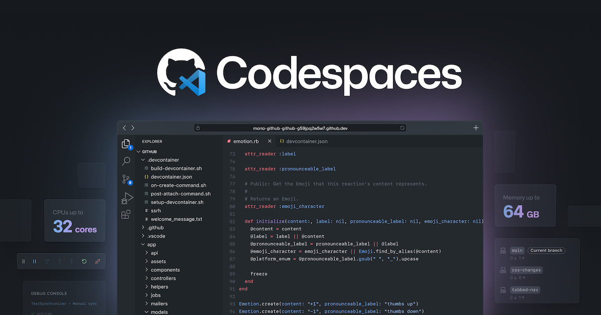
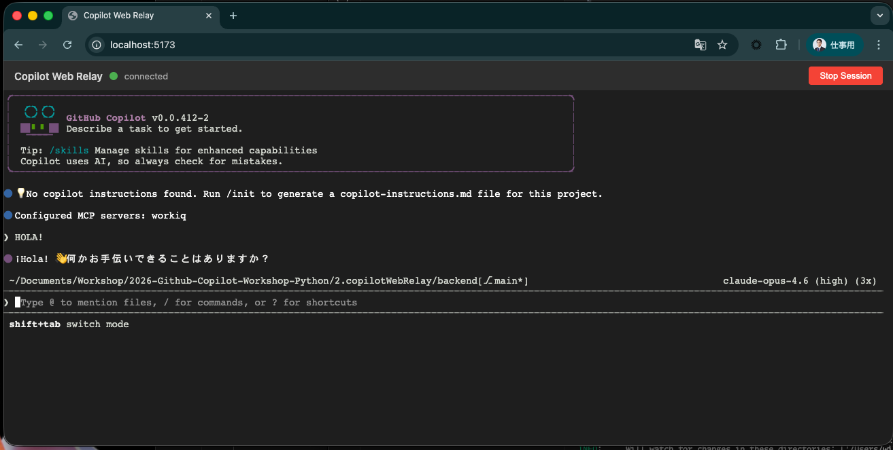

author: Your Name
summary: DENSO GitHub Copilot ワークショップ
id: github-copilot-workshop
categories: AI, Development
environments: Web
status: Published
feedback link: https://example.com/feedback

# DENSO GitHub Copilot ワークショップ

## ワークショップについて
Duration: 5

GitHub Copilotワークショップへようこそ！


このワークショップでは、**GitHub Copilot CLI** を中心に、最新の AI 駆動開発を体験していただきます。Copilot CLI はターミナル上で動作する対話型の AI アシスタントであり、コード生成・レビュー・リファクタリングなどの幅広いタスクを自律的に実行できます。

### 本日のゴール
- GitHub Copilot CLI の基本操作を理解する
- Copilot SDK を活用した Web アプリケーション開発を体験する
- 複数の AI モデルを使ったコードレビューを実践する
- Agentic Workflow による開発プロセスの自動化を構築する

### 本日のアジェンダ

| ステップ | 内容 | 概要 |
|---|---|---|
| 1 | ワークショップについて | 概要説明とゴールの確認 |
| 2 | プロジェクトセットアップ | リポジトリの作成と開発環境の準備 |
| 3 | Copilot Web Relay を作ろう | Copilot CLI + SDK で Web アプリを構築 |
| 4 | Copilot Code Review | 複数モデルを使ったコードレビュー |
| 5 | Agentic Workflow | AI エージェントによる開発プロセスの自動化 |

### 前提条件
- Visual Studio Code がインストールされていること
- GitHub Copilotのライセンスがあること（Business/Enterprise プラン推奨）
- GitHubアカウントを持っていること

## プロジェクトのセットアップ
Duration: 15

このワークショップでは、以下のGitHubリポジトリを使用します：

**プロジェクトURL**: https://github.com/moulongzhang/2026-Github-Copilot-Workshop-Python

### ステップ1: テンプレートからリポジトリを作成する

まず、上記のプロジェクトURLをブラウザで開き、テンプレートから自分のリポジトリを作成します：

1. プロジェクトURL（https://github.com/moulongzhang/2026-Github-Copilot-Workshop-Python）をブラウザで開く
2. 右上の **Use this template** ボタンをクリックし、**Create a new repository** を選択


> aside negative
>
> **⚠️ 重要**: リポジトリ作成時に **Visibility（公開設定）は必ず「Public」** を選択してください。Private リポジトリでは、一部の Copilot 機能や GitHub Actions が正しく動作しない場合があります。

テンプレートからの作成が完了すると、あなたのGitHubアカウントに新しいリポジトリが作成されます。

### ステップ2: 開発環境のセットアップ

作成したリポジトリを使って、GitHub Codespacesで開発環境を準備します：

1. 作成したリポジトリのページで（`https://github.com/[あなたのユーザー名]/moulongzhang`）
2. 緑色の **Code** ボタンをクリック
3. **Codespaces** タブを選択
4. **Create codespace on main** をクリック



### ステップ3: Copilot の設定確認

GitHubで利用可能なCopilot機能を有効化しましょう。

1. GitHubの右上のプロフィールアイコンをクリック
2. **Your Copilot** を選択


以下の機能を有効化してください：

- **Copilot CLI** - ターミナルでのCopilot利用
- **Copilot code review** - コードレビュー機能

> aside negative
>
> **プラン制限**: Copilot Code Review、Copilot CLIなどの高度な機能は、GitHub Copilot Business/Enterprise プランでのみ利用可能です。

## Copilot Web Relay を作ろう
Duration: 10

ここからは、**Copilot Web Relay** — ブラウザから GitHub Copilot CLI にアクセスできる Web アプリケーションを **Copilot CLI と Copilot SDK** を使って構築します。

このセクションでは、**事前に用意された設計書をCopilotに読み込ませ、設計書をもとに対話しながら段階的に実装していく**ワークフローを体験します。


### Copilot Web Relay とは？

ローカルで動作する GitHub Copilot CLI を、ターミナルを直接操作することなくブラウザ上のUIを通じてリアルタイムにやり取りできるようにするWebアプリケーションです。

### アーキテクチャ概要

| コンポーネント | 技術スタック | 役割 |
|---|---|---|
| **Browser** | React + TypeScript + Vite | ターミナル表示（xterm.js）、セッション管理 |
| **Backend Server** | Python (FastAPI) + WebSocket | Copilot CLI プロセスの管理、WebSocket ブリッジ |
| **CLI Bridge** | Python (asyncio + pexpect) | Copilot CLI の PTY（疑似端末）制御、入出力のストリーミング |

Browser ↔ WebSocket（双方向通信）↔ Backend Server ↔ PTY/stdin/stdout（子プロセス管理）↔ Copilot CLI

### 開発の進め方

このセクションでは以下の流れで進めます：

1. **設計書を確認** — プロジェクトに配布された設計書を確認し、アプリケーションの全体像を理解する
2. **GitHub Copilot CLI** — ターミナルで CLI を立ち上げ、問題なく動作することを確認する
3. **AI 駆動開発** — 設計書を活用し、GitHub Copilot CLI と対話しながら Web アプリケーションを Vibe Coding で実装する

> aside positive
>
> **このセクションのポイント**: Copilotのハイエンドモデルを GitHub Copilot の最新機能と組み合わせて利用した時に実現できるタスクの質と量を体感いただくことがゴールです。設計書を事前に用意しておくことで、Copilotに対して「何を作るか」の文脈を明確に伝えられます。実際の開発現場でも、設計ドキュメントをCopilotのコンテキストとして活用するのは非常に効果的なプラクティスです。

## 設計書の確認と GitHub Copilot CLI
Duration: 15

### 1. 設計書の確認

プロジェクト内の `copilotWebRelay/planning.md` に、Copilot Web Relay の設計書が配布されています。まずはこのファイルを開いて、アプリケーションの全体像を確認しましょう。

設計書には以下の内容が含まれています：

- **アーキテクチャ**: Browser ↔ WebSocket ↔ FastAPI ↔ PTY ↔ Copilot CLI の構成
- **コンポーネント構成**: Frontend（React/TS）、Backend（FastAPI）、CLI Bridge（pexpect）
- **機能要件**: Phase 1（MVP）と Phase 2（チャット UI 強化）
- **WebSocket プロトコル設計**: メッセージ形式と状態管理の仕様
- **ディレクトリ構造**: ファイル配置と各ファイルの役割
- **実装タスク一覧**: タスク間の依存関係
- **実装上の重要な注意事項**: つまずきやすいポイントの事前対策

> aside positive
>
> **設計書を活用するコツ**: この後の実装フェーズでは、GitHub Copilot CLI に対してプロンプトを投げる際に `planning.md を参照して` と指示することで、Copilot が設計書の文脈を理解した上でコードを生成してくれます。

### 2. GitHub Copilot CLI の起動確認

VS Code のターミナルを開き、以下のコマンドを入力して GitHub Copilot CLI を起動してみましょう：

```bash
copilot
```

正常に起動すると、対話型のインターフェースが表示されます。`/help` と入力して、利用可能なコマンドを確認してみましょう。

> aside negative
>
> **GitHub Copilot CLI のセットアップについて**
> 通常、GitHub Copilot CLI を利用するには **GitHub CLI (`gh`)** のインストールと Copilot 拡張機能のセットアップが必要です。今回のワークショップでは、**DevContainer の設定に GitHub Copilot CLI のインストールと認証が含まれている**ため、Codespaces を起動すれば `copilot` コマンドがすぐに利用できます。
>
> 自身の環境でセットアップする場合は、以下の手順が必要です：
> 1. GitHub CLI をインストール: `brew install gh`（macOS）
> 2. GitHub CLI で認証: `gh auth login`
> 3. Copilot 拡張機能をインストール: `gh extension install github/copilot-cli`

### 3. GitHub Copilot CLI のコマンド一覧

GitHub Copilot CLI では、テキストで自然言語の指示を入力するほか、`/` で始まるスラッシュコマンドを使用できます。

#### コード関連

| コマンド | 説明 |
|---|---|
| `/ide` | IDE ワークスペースに接続 |
| `/diff` | 現在のディレクトリの変更差分を確認 |
| `/review` | コードレビューエージェントを実行して変更を分析 |
| `/lsp` | 言語サーバーの設定を管理 |
| `/terminal-setup` | マルチライン入力（Shift+Enter / Ctrl+Enter）のターミナル設定 |

#### パーミッション

| コマンド | 説明 |
|---|---|
| `/allow-all` | すべてのパーミッション（ツール・パス・URL）を有効化 |
| `/add-dir` | ファイルアクセスの許可ディレクトリを追加 |
| `/list-dirs` | 許可されたディレクトリの一覧を表示 |
| `/cwd` | 作業ディレクトリを変更または表示 |
| `/reset-allowed-tools` | 許可ツールのリストをリセット |

#### セッション管理

| コマンド | 説明 |
|---|---|
| `/resume` | 別のセッションに切り替え（セッションID指定可） |
| `/rename` | 現在のセッション名を変更 |
| `/context` | コンテキストウィンドウのトークン使用量を表示 |
| `/usage` | セッションの使用状況メトリクスと統計を表示 |
| `/session` | セッション情報とワークスペースサマリーを表示 |
| `/compact` | 会話履歴を要約してコンテキストウィンドウの使用量を削減 |
| `/share` | セッションを Markdown ファイルまたは GitHub Gist としてエクスポート |

#### ヘルプ・フィードバック

| コマンド | 説明 |
|---|---|
| `/help` | 対話コマンドのヘルプを表示 |
| `/changelog` | CLI バージョンの変更履歴を表示 |
| `/feedback` | CLI に関するフィードバックを送信 |
| `/theme` | ターミナルテーマの確認・設定 |
| `/experimental` | 利用可能な実験的機能の表示、実験モードの切り替え |

#### その他

| コマンド | 説明 |
|---|---|
| `/model` | 使用する AI モデルを選択（GPT、Claude、Gemini 等） |
| `/clear` , `/new` | 会話履歴をクリア |
| `/plan` | コーディング前に実装計画を作成 |
| `/instructions` | カスタム指示ファイルの表示・切り替え |
| `/diagnose` | 現在のセッションログを分析 |
| `/login` , `/logout` | Copilot へのログイン・ログアウト |
| `/user` | GitHub ユーザーの管理 |
| `/exit` , `/quit` | CLI を終了 |

#### カスタム指示ファイル

Copilot CLI は以下の場所にあるカスタム指示ファイルを自動的に読み込みます：

- `CLAUDE.md` / `GEMINI.md` / `AGENTS.md`（git ルートおよびカレントディレクトリ）
- `.github/instructions/**/*.instructions.md`（git ルートおよびカレントディレクトリ）
- `.github/copilot-instructions.md`
- `$HOME/.copilot/copilot-instructions.md`

> aside positive
>
> **CLI のヒント**: `/model` コマンドでモデルを切り替えることができます。実装がうまく進まない場合は、別のモデルを試してみると良い結果が得られることがあります。`/plan` コマンドを使うとコーディング前に実装計画を自動生成できるので、設計書と組み合わせると効果的です。

## Vibe Coding で実装しよう
Duration: 60

設計書の確認と GitHub Copilot CLI の動作確認ができたら、いよいよ **Vibe Coding** で Copilot Web Relay を実装していきます。

以下の 4 ステップを順番に実行するだけで、Copilot が設計書をもとにアプリケーションを構築してくれます。

### ステップ 1: Copilot CLI を起動する

VS Code のターミナルで Copilot CLI を起動します。

```bash
copilot
```

### ステップ 2: すべてのパーミッションを許可する

```
/allow-all
```

`/allow-all` は、Copilot CLI に対して**ツールの実行・ファイルアクセス・外部URLへのアクセス**のすべてのパーミッションを一括で許可するコマンドです。

通常、Copilot CLI はセキュリティのために、ファイルの読み書きやコマンドの実行、外部通信を行う際にユーザーへ都度許可を求めます。`/allow-all` を実行することで、これらの確認プロンプトをスキップし、Copilot がファイルの作成・編集、パッケージのインストール、サーバーの起動などを自律的に実行できるようになります。

> aside negative
>
> **注意**: `/allow-all` は現在のセッションに対してのみ有効です。セキュリティ上、信頼できるプロジェクトでのみ使用してください。個別に許可したい場合は、`/add-dir` でディレクトリ単位のアクセス許可を設定することもできます。

### ステップ 3: ハイエンドモデルを選択する

```
/model Claude Opus 4.6
```

最も高性能なモデルを選択します。Copilot CLI は `/model` コマンドで使用する AI モデルを切り替えることができ、タスクの複雑さに応じて最適なモデルを選べます。今回のような複数コンポーネントを持つ Web アプリケーションの構築には、推論能力の高いハイエンドモデルが効果的です。

### ステップ 4: Fleet モードで一気に実装する

```
/fleet Copilot Web Relay — ブラウザから GitHub Copilot CLI にアクセスできる Web アプリケーションを構築します。copilotWebRelay/planning.md の計画に沿って実装を進めてください。不明なことがあれば事前に私に聞いてください。
```

`/fleet` は、**複数のサブエージェントを並行して起動し、大規模なタスクを分割・同時実行する**ためのコマンドです。

通常の Copilot CLI では 1 つのタスクを順番に処理しますが、`/fleet` を使うと Copilot が自動的にタスクを分解し、バックエンドの実装・フロントエンドの実装・設定ファイルの作成など複数の作業を**並行して進めます**。これにより、従来1つずつ指示して進めていた作業を、一度の指示で一気に完成させることができます。

Fleet モードでは以下のことが自動的に行われます：

- **タスクの分解**: 設計書を読み取り、実装すべきコンポーネントを特定
- **並行実装**: バックエンド（FastAPI + CLI Bridge + WebSocket）とフロントエンド（React + xterm.js）を同時に実装
- **依存関係の解決**: パッケージのインストール、設定ファイルの生成
- **統合テスト**: 実装後の動作確認

> aside positive
>
> **Fleet モードのポイント**: Copilot が質問してきた場合は、適切に回答してください。設計書に記載されている内容であれば「planning.md を参照してください」と返答するのも効果的です。実装の進行状況はターミナルにリアルタイムで表示されます。

### つまずいた場合のヒント

Fleet モードの実装でエラーが発生した場合は、以下を試してみましょう：

- **エラーメッセージをそのまま Copilot に共有**: 「このエラーを修正してください」と伝えるだけで修正してくれます
- **`/diff` で変更内容を確認**: 意図しない変更がないかチェック
- **`/model` でモデルを変更**: 別のモデルに切り替えて再試行
- **設計書の注意事項を確認**: `planning.md` の「実装上の重要な注意事項」セクションに、よくあるバグの対処法が記載されています

> aside negative
>
> **よくあるつまずきポイント**:
> - **Vite の WebSocket プロキシ**: `target` に `ws://` ではなく `http://` を指定する必要があります
> - **React StrictMode**: `useEffect` が2回実行される問題で WebSocket 接続が不安定になることがあります
> - **FastAPI のルーティング順序**: StaticFiles のマウントは WebSocket エンドポイントの後に定義する必要があります
> - **xterm.js v5 のパッケージ名**: `xterm-addon-fit` ではなく `@xterm/addon-fit` を使用してください

以下が、私の場合の1ショットでプロンプトを流した実装結果です。



## Copilot Code Review — 複数モデルによるコードレビュー
Duration: 30

Copilot Web Relay の実装が完了したら、**Copilot CLI のレビュー関連コマンド** を使って、複数の AI モデルでコードレビューを行いましょう。異なるモデルの視点から品質・セキュリティ・パフォーマンスの問題を多角的に検出することがゴールです。

### レビューに使う主なコマンド

Copilot CLI にはコードレビューに活用できるコマンドが複数用意されています。

| コマンド | 説明 |
|---|---|
| `/review` | コードレビューエージェントを実行して変更を分析する |
| `/diff` | 現在のディレクトリの変更差分を確認する |
| `/model` | 使用する AI モデルを選択する（Claude、GPT、Gemini 等） |
| `/pr` | 現在のブランチの Pull Request を操作する |
| `/share` | セッションを Markdown ファイル、HTML ファイル、または GitHub Gist としてエクスポートする |
| `/copy` | 直前のレスポンスをクリップボードにコピーする |
| `/compact` | 会話履歴を要約してコンテキストウィンドウの使用量を削減する |
| `/rewind` | 直前のターンを巻き戻し、ファイル変更を元に戻す |

### ステップ 1: 変更差分を確認する

まず、Copilot Web Relay の実装でどのような変更が入ったかを `/diff` で確認しましょう。

```
/diff
```

`/diff` は現在のディレクトリの変更差分をレビューするコマンドです。レビュー前に変更の全体像を把握しておくことで、レビュー結果の理解が深まります。

### ステップ 2: コードをコミット & Push する

Copilot CLI で以下のように指示して、実装をコミット & Push します：

```
実装した Copilot Web Relay のコードをすべて git add して、適切なコミットメッセージでコミットし、feature/copilot-web-relay ブランチにプッシュしてください。
```

### ステップ 3: モデル 1 — Claude でレビュー

Copilot CLI のデフォルトモデルは **Claude Sonnet 4.5** です。`/model` コマンドで使用するモデルを確認・切り替えできます。

```
/model
```

モデル一覧が表示されるので、Claude 系のモデルを選択してください。選択したら、レビューを実行します：

```
/review
```

`/review` コマンドはコードレビューエージェントを起動し、以下の観点で変更差分を自動分析します：

- **バグ・論理エラー**: 実行時に発生しうる問題
- **セキュリティ脆弱性**: インジェクション攻撃、認証の不備など
- **パフォーマンス**: 非効率な処理やメモリリーク
- **ベストプラクティス**: 言語やフレームワークの慣習への適合

レビュー結果は `/copy` でクリップボードにコピーするか、`/share` でファイルに保存しておきましょう：

```
/copy
```

> aside positive
>
> **ヒント**: `/share` コマンドを使うと、セッションの内容を Markdown ファイル、HTML ファイル、または GitHub Gist としてエクスポートできます。後でモデル間のレビュー結果を比較する際に便利です。

### ステップ 4: モデル 2 — GPT でレビュー

会話をリセットして、GPT モデルに切り替えてレビューを実行します。

```
/new
```

```
/model
```

モデル一覧から GPT 系のモデル（例: GPT-5）を選択してください。

```
/review
```

レビュー結果を保存します：

```
/copy
```

### ステップ 5: モデル 3 — Gemini でレビュー

同様に、Gemini モデルでもレビューを実行します。

```
/new
```

```
/model
```

モデル一覧から Gemini 系のモデル（例: Gemini 2.5 Pro）を選択してください。

```
/review
```

```
/copy
```

> aside negative
>
> **注意**: `/model` で選択可能なモデルは、ご利用のCopilotプランや組織の設定によって異なる場合があります。各モデルの利用にはプレミアムリクエストが消費されます。

### ステップ 6: レビュー結果の比較と改善

3つのモデルによるレビュー結果を比較してみましょう。`/compact` でコンテキストを整理してから、以下のプロンプトを入力してください：

```
先ほど3つの異なるモデル（Claude、GPT、Gemini）で /review を実行しました。それぞれのレビューで指摘された内容を整理して、以下の観点で比較表を作成してください：
- バグ・論理エラー
- セキュリティ
- パフォーマンス
- コード品質・ベストプラクティス

その上で、すべてのモデルが共通して指摘した問題を優先的に修正してください。
```

修正に問題があった場合は、`/rewind` で直前のターンを巻き戻してファイル変更を元に戻すことができます。

> aside positive
>
> **複数モデルレビューのメリット**:
> - **Claude**: 論理的な整合性やエッジケースの検出に強い
> - **GPT**: 幅広いベストプラクティスの指摘が得意
> - **Gemini**: セキュリティやパフォーマンスの観点に優れる
>
> 3つのモデルが共通して指摘する問題は、信頼度が高く優先的に修正すべき問題です。

### ステップ 7: Pull Request の作成と GitHub 上での Code Review

ローカルでの修正が完了したら、`/pr` コマンドで Pull Request を操作できます。または GitHub 上で Pull Request を作成し、GitHub の Copilot Code Review 機能も併用しましょう：

1. 修正したコードをコミット & Push
2. GitHub 上で Pull Request を作成
3. **Reviewers** セクションで **Copilot** をレビュワーとしてアサイン


> aside positive
>
> **CLI レビューと GitHub レビューの使い分け**:
> - **`/review`（CLI）**: ローカルの変更差分を対象に即座にレビューを実行。開発中の早い段階で問題を検出できる
> - **`/pr`（CLI）**: 現在のブランチの Pull Request を CLI から直接操作できる
> - **GitHub Code Review**: Pull Request の差分を対象に、フォーマルなレビューコメントを残す。チームでのレビューフローに最適
>
> 両方を組み合わせることで、開発の早い段階から品質を担保できます。

## Agentic Workflow — AI エージェントによる開発プロセスの自動化
Duration: 20

最後のステップでは、**GitHub Agentic Workflow** を構築し、AI エージェントが開発プロセスを自律的に自動化する仕組みを体験しましょう。

### Agentic Workflow とは

**Agentic Workflow** は、GitHub Actions 上で AI エージェントが作業を自律的に実行する仕組みです。2026年2月13日にテクニカルプレビューとして発表されました。

従来の GitHub Actions はあらかじめ決められたステップを順番に実行するものでしたが、Agentic Workflow では **AI が状況を判断し、必要なアクションを自律的に決定・実行** します。

### 何ができるか

Agentic Workflow を使うことで、以下のような開発タスクを AI エージェントに委任できます：

| ユースケース | 説明 |
|---|---|
| **Issue の自動トリアージ** | 新しい Issue の内容を AI が分析し、ラベル付け・担当者アサイン・優先度設定を自動実行 |
| **PR レビューの自動化** | Pull Request の変更内容を AI がレビューし、コメントや改善提案を自動投稿 |
| **CI エラーの分析と修正** | CI/CD パイプラインのエラーを AI が分析し、原因特定と修正 PR の自動作成 |
| **ドキュメント管理** | コード変更に連動してドキュメントを自動更新し、コードとドキュメントの一貫性を維持 |
| **リリースノート生成** | マージされた PR やコミット履歴から、リリースノートを自動生成 |

### 主なメリット

- **自然言語で記述**: ワークフローの目的を自然言語（Markdown）で記述するだけで、AI が処理内容を判断して実行する
- **柔軟なトリガー**: スケジュール実行、イベントトリガー（Push、PR作成）、Issue コメントコマンドなど、多様な起動条件に対応
- **自律的な判断**: AI エージェントがコードの変更内容を理解し、何をすべきかを自ら判断する

### 始め方

Agentic Workflow は `gh aw` CLI 拡張機能を使って作成します：

1. **Markdown ファイルを作成** — ワークフローの目的と動作を自然言語で記述
2. **コンパイル** — `gh aw` が Markdown を GitHub Actions のワークフロー YAML に変換
3. **コミット & Push** — ワークフローがリポジトリに追加され、トリガー条件に応じて自動実行

> aside positive
>
> **参考**: サンプルユースケースは「Peli's Agent Factory」（https://github.com/peli-pro-hq/agent-factory）で多数公開されています。

### ステップ 1: PAT（Personal Access Token）の作成

Agentic Workflow が GitHub Actions で Copilot を利用するために、Personal Access Token を作成します。

#### Fine-grained PAT の作成

以下のURLにアクセスして、新しいFine-grained PATを作成します：

[https://github.com/settings/personal-access-tokens/new](https://github.com/settings/personal-access-tokens/new)

設定内容：
- **Token name**: 任意の名前を入力してください（例: `copilot-workshop`）
- **Resource owner**: 自分のユーザーアカウントを選択
- **Repository access**: **Public repositories** を選択
- **Permissions**: **Copilot Requests** を有効化


作成が完了したら、表示されたPATを必ずコピーしてください。

> aside negative
>
> **⚠️ 注意**: PATは作成直後の画面でのみ表示されます。画面遷移すると二度と確認できなくなるため、必ずこのタイミングでコピーしてください。

#### Repository Secret に設定

作成したPATをリポジトリのシークレットとして設定します：

1. 自分のリポジトリの **Settings** タブをクリック
2. 左サイドバーから **Secrets and variables** → **Actions** を選択
3. **New repository secret** をクリック
4. 以下の内容を入力：
   - **Name**: `COPILOT_GITHUB_TOKEN`
   - **Value**: 先ほど作成したPATを貼り付け
5. **Add secret** をクリック

#### Workflow permissions の確認

1. 自分のリポジトリの **Settings** タブをクリック
2. 左サイドバーから **Actions** → **General** を選択
3. **Workflow permissions** セクションで **Allow GitHub Actions to create and approve pull requests** にチェックが入っていることを確認
4. チェックが入っていない場合は有効化して **Save** をクリック

### ステップ 2: ドキュメント自動更新ワークフローの作成

まずは、コード変更に連動してドキュメントを自動更新する Agentic Workflow を作成しましょう。Copilot CLI で以下のプロンプトを入力してください：

```
以下のURLを参照して GitHub Agentic Workflow を作成してください。
https://github.com/github/gh-aw/blob/main/create.md

ワークフローの目的は以下のとおりです：
- copilotWebRelay 配下のコードが更新された時に実行されます
- copilotWebRelay 配下のコードの内容に応じて copilotWebRelay/docs のドキュメンテーションを更新し、ソースコードとドキュメンテーションが常に一致するようにします
```

### ステップ 3: ワークフローの動作確認

ワークフローが作成できたら、コードに変更を加えて動作を確認しましょう：

1. Copilot Web Relay のコードに小さな変更を加える（例: コメントの追加、関数の改善など）
2. 変更をコミットして Push する
3. GitHub の **Actions** タブでワークフローが実行されていることを確認
4. ワークフロー完了後、ドキュメントを更新する **Pull Request** が自動的に作成されることを確認

> aside positive
>
> **ポイント**: AI エージェントがコードの差分を読み取り、変更内容に応じて適切なドキュメント更新を自律的に判断・実行します。開発者がドキュメント更新を忘れても、常にコードとドキュメントの一貫性が保たれます。

### ステップ 4: Auto Healing DevOps の作成（オプション）

余裕がある方は、CI/CD のジョブが失敗した時にそれを検知して自動修正する Agentic Workflow も作成してみましょう。これは **CI エラー分析** のユースケースです。

```
以下のURLを参照して GitHub Agentic Workflow を作成してください。
https://github.com/github/gh-aw/blob/main/create.md

ワークフローの目的は以下のとおりです：
リポジトリで失敗したワークフロー実行を検知し、原因を分析してIssueを自動作成する。
作成したissueにはCopilotを自動アサインする。
```

ワークフローが作成できたら、意図的にビルドを失敗させて動作を確認します：

```
System.out.println("Hello World!"); を System.out.println("Hell World!"); にして push して
```

Push 後、GitHub Actions のワークフローが失敗を検知し、Copilot が自動的に Issue を作成してアサインされることを確認しましょう。

> aside positive
>
> **Agentic Workflow の可能性**: 今回体験したドキュメント自動更新と CI エラー分析は、Agentic Workflow のほんの一例です。Issue のトリアージ、PR レビュー、リリースノート生成、セキュリティスキャンの自動化など、開発プロセスのあらゆる場面で AI エージェントを活用できます。

## おめでとうございます 🎉
Duration: 5

### 今日学んだこと

このワークショップでは以下のことを学びました：

1. **GitHub Copilot CLI の基本操作** — ターミナル上でのAIアシスタントの活用
2. **Copilot SDK を活用した Web アプリケーション開発** — 設計書駆動の Vibe Coding と Fleet モードによる並行実装
3. **複数モデルによるコードレビュー** — Claude、GPT、Gemini を使い分けた多角的なコード品質チェック
4. **Agentic Workflow** — GitHub Actions 上で AI エージェントが開発プロセスを自律的に自動化する仕組みの構築

### 次のステップ

- 実際のプロジェクトで Copilot CLI を活用してみる
- `/review` を日常のコードレビューワークフローに組み込む
- Agentic Workflow を自社のCI/CDパイプラインに導入する
- Copilotの新機能をキャッチアップする

### リソース

- [GitHub Copilot Documentation](https://docs.github.com/copilot)
- [GitHub Copilot ベストプラクティス](https://docs.github.com/copilot/using-github-copilot/best-practices-for-using-github-copilot)
- [GitHub Copilot CLI](https://docs.github.com/copilot/github-copilot-in-the-cli)

お疲れさまでした！
